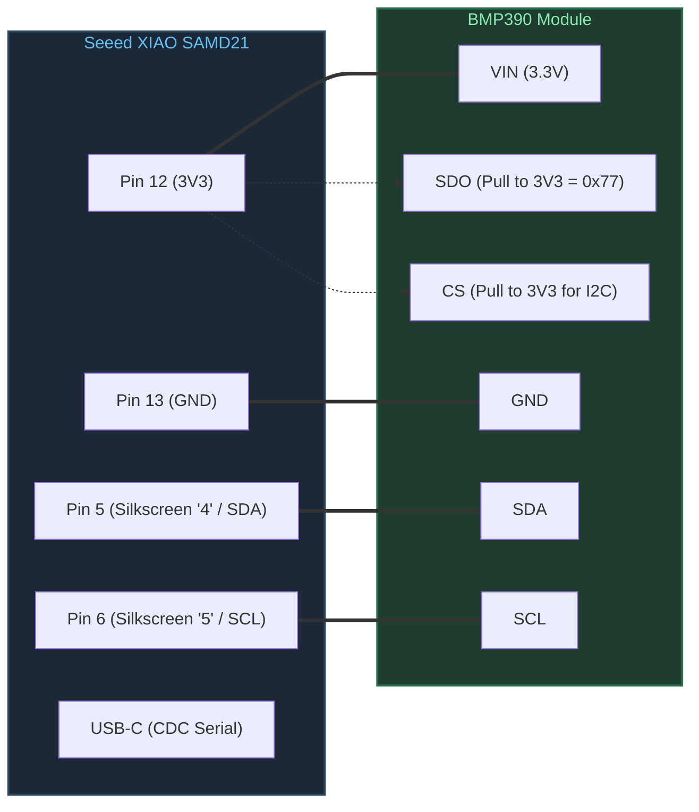

# VarioUSB — USB Variometer for Flight Instruments

[](https://platformio.org/)
[](https://wiki.seeedstudio.com/Seeeduino-XIAO/)
[](https://www.bosch-sensortec.com/products/environmental-sensors/pressure-sensors/bmp390/)
[-lightgrey.svg)]()

**VarioUSB** is an ultra-compact, high-precision barometric variometer designed for paragliding, hang gliding, and sailplane soaring. It pairs a **Seeed Studio XIAO SAMD21** with a **Bosch Sensortec BMP390** precision pressure sensor to stream real-time vertical speed and pressure data directly to flight computers and navigation apps (**XCSoar**, **LK8000**, **XCTrack**) over native USB CDC.

---

## Key Features

- **High Precision:** Bosch BMP390 barometric sensor operating with x8 pressure oversampling and on-chip IIR filtering.
- **Fast Sampling & Low Latency:** Sensor acquired at **50 Hz** (20 ms interval); real-time vertical speed filtered via integer single-pole IIR ($\tau \approx 187$ ms).
- **Aviation Standard Telemetry:** Formats and streams standard **LK8EX1** NMEA sentences at **10 Hz** over USB CDC.
- **Embedded Strict Design:**
  - Zero dynamic heap allocation (`no malloc`, `no new`).
  - No floating-point operations (pure 32-bit & 64-bit fixed-point integer mathematics for Cortex-M0+).
  - No C++ exceptions or RTTI (`-fno-exceptions -fno-rtti`).
  - Strict hierarchical layers (`common/` → `hal/` → `drivers/` → `middleware/` → `app/`).

---

## Hardware Wiring Guide

The Seeed Studio XIAO SAMD21 does **not** explicitly label peripheral functions like `SDA` or `SCL` on its top silkscreen; it only numbers the GPIOs from `0` to `10`.

### Physical Pin Connection Table

| Seeed XIAO Silkscreen | Physical Pin | Arduino / MCU Port | Function | BMP390 Breakout Pin | Notes |
|:---:|:---:|:---:|:---:|:---:|:---|
| **`3V3`** | Pin 12 | 3.3V LDO Output | Power (3.3V) | **`VIN`** / **`VCC`** | Native 3.3V logic level |
| **`GND`** | Pin 13 | Ground Reference | Ground | **`GND`** | Common ground reference |
| **`4`** | Pin 5 | `D4` / `A4` / `PA08` | **I2C SDA** | **`SDA`** / `SDI` | SERCOM2 PAD[0] |
| **`5`** | Pin 6 | `D5` / `A5` / `PA09` | **I2C SCL** | **`SCL`** / `SCK` | SERCOM2 PAD[1] |
| — | — | — | Address Select | **`SDO`** / `ADDR` | Pull to **`3V3`** for address **`0x77`** |
| — | — | — | Bus Mode Select| **`CS`** | Pull to **`3V3`** for I2C mode |
| — | — | — | Interrupt | **`INT`** | Leave unconnected (NC) |

### Wiring Diagram

```text
               Seeed XIAO SAMD21                   Bosch BMP390 Breakout
             +-------------------+                 +-------------------+
             |    [ USB-C ]      |                 |                   |
    [0]  D0  | 1              14 | 5V              |                   |
    [1]  D1  | 2              13 | GND  <--------> | GND               |
    [2]  D2  | 3              12 | 3V3  <--------> | VIN / VCC         |
    [3]  D3  | 4              11 | D10             |                   |
    [4]  D4  | 5 (SDA)        10 | D9   <--------> | SDA / SDI         |
    [5]  D5  | 6 (SCL)         9 | D8   <--------> | SCL / SCK         |
    [6]  D6  | 7               8 | D7              | SDO/ADDR -> 3.3V  |
             +-------------------+                 | CS       -> 3.3V  |
                  [RST] Pads                       +-------------------+
```



For complete electrical specifications, pull-up recommendations, and board variants, see [docs/hardware_wiring.md](file:///docs/hardware_wiring.md).

---

## Output Protocol: LK8EX1

VarioUSB streams standard NMEA sentence **`$LK8EX1`** at 10 Hz over USB CDC (115200 baud):

```text
$LK8EX1,pressure,altitude,vario,temperature,battery,*checksum<CR><LF>
```

### Sentence Field Breakdown

| Field | Example Value | Description |
|---|:---:|---|
| Prefix | `$LK8EX1` | Protocol sentence identifier |
| Pressure | `101325` | Raw pressure in Pascals (e.g. 101325 Pa = 1013.25 hPa) |
| Altitude | `99999` | Placeholder (flight app computes altitude from pressure) |
| Vario | `15` | Vertical speed in cm/s (e.g., `+15` = +0.15 m/s, `-120` = -1.20 m/s) |
| Temperature | `21` | Ambient temperature in integer °C |
| Battery | `999` | Placeholder (USB-powered device) |
| Checksum | `*3A` | Standard NMEA 8-bit XOR checksum between `$` and `*` |

---

## Build & Flash Instructions

### Prerequisites
- [PlatformIO Core (CLI)](https://platformio.org/) or [VS Code with PlatformIO IDE](https://marketplace.visualstudio.com/items?itemName=platformio.platformio-ide).

### Using VS Code Tasks
Preconfigured tasks are available in [.vscode/tasks.json](file:///.vscode/tasks.json):
1. **Compile:** Press <kbd>Ctrl</kbd> + <kbd>Shift</kbd> + <kbd>B</kbd> (`PlatformIO: Build`).
2. **Flash (Upload):** Open Command Palette (<kbd>Ctrl</kbd> + <kbd>Shift</kbd> + <kbd>P</kbd>), select `Tasks: Run Task` → **`PlatformIO: Flash (Upload)`**.
3. **Serial Monitor:** Run task **`PlatformIO: Monitor (Série 115200)`**.

### Using PlatformIO CLI
```bash
# Build firmware
pio run

# Flash to connected Seeed XIAO board
pio run --target upload

# Open serial monitor at 115200 baud
pio device monitor
```

> [!TIP]
> **Bootloader Recovery (Double-Tap Reset):**  
> If the board is unresponsive or upload fails to find the COM port, short the two golden **RST** pads on the underside of the XIAO board twice rapidly using tweezers. The onboard orange LED will pulse slowly, indicating UF2 bootloader mode. You can now re-run the upload task.

---

## Repository Structure

```text
VarioUSB/
├── .vscode/               # VS Code tasks & debug configuration
├── docs/
│   ├── hardware_wiring.md # Detailed hardware pinout, electrical specs & schematics
│   └── architecture.md    # Layered architecture, register map & fixed-point math
├── src/
│   ├── app/               # Application orchestrator (50 Hz & 10 Hz loops)
│   ├── common/            # Constants, error codes, and POD types
│   ├── drivers/           # Bosch BMP390 driver & integer compensation
│   ├── hal/               # I2C (Wire) and USB Serial (CDC) HAL
│   ├── middleware/        # Vario dP/dt engine & LK8EX1 formatter
│   └── main.cpp           # Arduino setup() & loop() entry point
├── tools/
│   └── vario_monitor/     # Python GUI monitor, flight logger & TCP bridge to VarioAppli
├── platformio.ini         # PlatformIO configuration (ATSAMD21G18A, flags)
└── README.md              # Project documentation and quick start
```

---

## PC Telemetry Monitor & Flight Recorder (GUI)

A Python desktop utility is provided in [`tools/vario_monitor/`](file:///tools/vario_monitor/README.md) to inspect, log, and forward the real-time LK8EX1 data stream on your PC:

- **Live Stream:** Displays decoded vertical speed (Vz), barometric pressure, altitude, temperature, and checksum verification.
- **Flight Recorder:** Saves telemetry into `.nmea` flight logs and synchronised `.csv` files.
- **Simulation Mode:** Generates realistic thermal climb and sink data at 10 Hz if hardware is not connected.
- **Bridge to `VarioAppli`:** Includes a multi-client TCP bridge server (port 8888) to stream live data into the Android application running on emulator or mobile.

To launch:
```powershell
# Double click tools/vario_monitor/run_monitor.bat or run:
cd tools/vario_monitor
py main.py
```

---

For in-depth technical documentation, refer to:
- [Hardware Wiring & Pinout Guide](file:///docs/hardware_wiring.md)
- [Software Architecture & Fixed-Point Math Reference](file:///docs/architecture.md)
- [Python Monitor & Flight Recorder Guide](file:///tools/vario_monitor/README.md)
