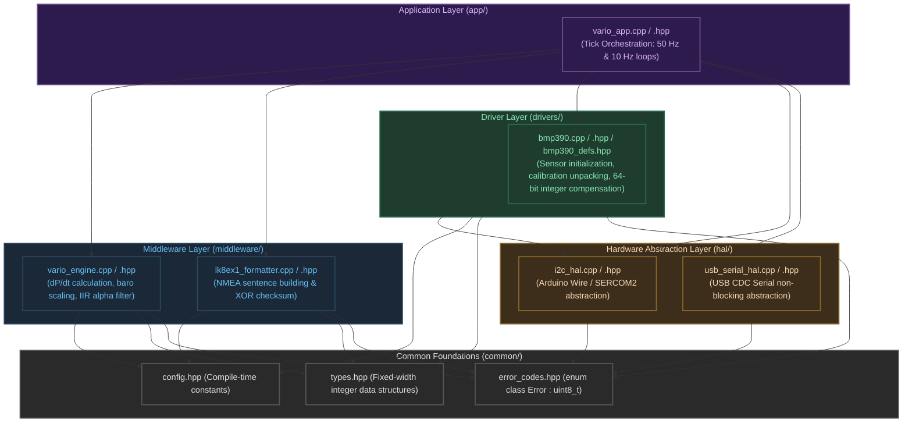
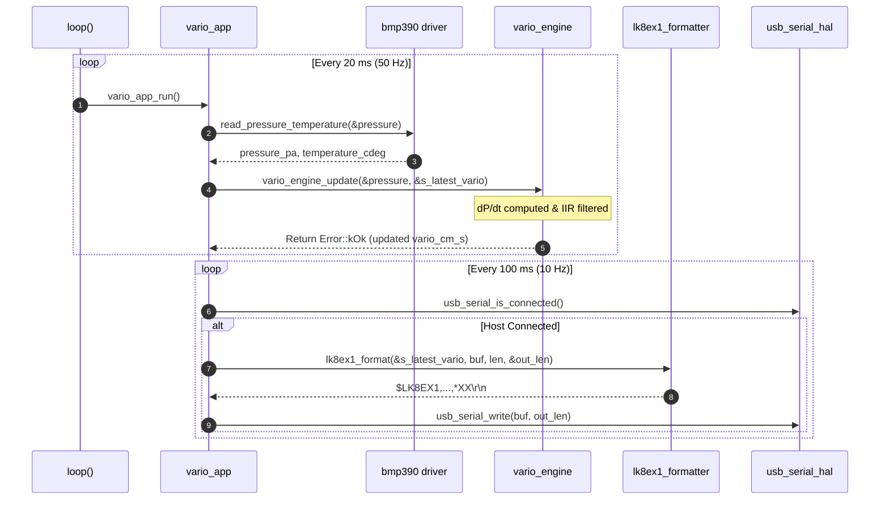

# Software Architecture & Mathematical Reference

This document details the layered embedded architecture, register maps, and fixed-point integer mathematics implemented in the **VarioUSB** firmware.

---

## 1. Architectural Layers & Boundaries

The firmware follows strict hierarchical layer isolation without dynamic memory allocation (`malloc`, `new`) or C++ exceptions. Lower layers never depend on or reference upper layers.



### Execution Timing Sequence

The system operates in a deterministic cooperative loop (`setup()` / `loop()`):
- **50 Hz Task (every 20 ms):** Reads raw pressure/temperature registers, runs integer compensation, updates rate-of-change, and executes the discrete-time IIR filter.
- **10 Hz Task (every 100 ms):** Formats the latest filtered data into standard NMEA `$LK8EX1` sentences and streams them via USB CDC.



---

## 2. Bosch BMP390 Register & Memory Map

The BMP390 sensor registers are accessed over I2C at address `0x77` (or `0x76`):

| Address | Name | Type | Reset Value | Description / Bit Configuration in VarioUSB |
|:---:|:---:|:---:|:---:|:---|
| `0x00` | `CHIP_ID` | RO | `0x60` | Chip identification byte (verified during initialization) |
| `0x02` | `ERR_REG` | RO | `0x00` | Sensor error status register |
| `0x03` | `STATUS` | RO | `0x00` | Bit 4: `CMD_RDY`, Bit 5: `drdy_press`, Bit 6: `drdy_temp` |
| `0x04` | `DATA_0` | RO | `0x00` | Pressure XLSB [7:0] |
| `0x05` | `DATA_1` | RO | `0x00` | Pressure LSB [15:8] |
| `0x06` | `DATA_2` | RO | `0x00` | Pressure MSB [23:16] |
| `0x07` | `DATA_3` | RO | `0x00` | Temperature XLSB [7:0] |
| `0x08` | `DATA_4` | RO | `0x00` | Temperature LSB [15:8] |
| `0x09` | `DATA_5` | RO | `0x00` | Temperature MSB [23:16] |
| `0x19` | `INT_CTRL`| RW | `0x00` | Interrupt control configuration |
| `0x1A` | `IF_CONF` | RW | `0x00` | Serial interface configuration |
| `0x1B` | `PWR_CTRL`| RW | `0x00` | Power control: `0x33` (`press_en=1`, `temp_en=1`, `mode=0x30` Normal) |
| `0x1C` | `OSR`      | RW | `0x00` | Oversampling: `0x03` (Pressure x8: `osr_p=3`, Temp x1: `osr_t=0`) |
| `0x1D` | `ODR`      | RW | `0x00` | Output Data Rate: `0x02` (50 Hz sampling) |
| `0x1F` | `CONFIG`   | RW | `0x00` | IIR filter coefficient: `0x04` (`iir_filter = 2` -> coeff 3) |
| `0x31` | `NVM_PAR`  | RO | — | Start of 21-byte non-volatile trimming parameters block |
| `0x7E` | `CMD`      | WO | `0x00` | Command register (`0xB6` = Soft Reset) |

### NVM Trimming Parameters Block (21 bytes starting at `0x31`)

| Offset | Variable | Type | Trimming Parameter Description |
|:---:|:---:|:---:|:---|
| 0–1 | `par_t1` | `uint16_t` | Temperature coefficient 1 |
| 2–3 | `par_t2` | `uint16_t` | Temperature coefficient 2 |
| 4 | `par_t3` | `int8_t` | Temperature coefficient 3 |
| 5–6 | `par_p1` | `int16_t` | Pressure sensitivity coefficient 1 |
| 7–8 | `par_p2` | `int16_t` | Pressure sensitivity coefficient 2 |
| 9 | `par_p3` | `int8_t` | Pressure coefficient 3 |
| 10 | `par_p4` | `int8_t` | Pressure coefficient 4 |
| 11–12 | `par_p5` | `uint16_t` | Pressure coefficient 5 |
| 13–14 | `par_p6` | `uint16_t` | Pressure coefficient 6 |
| 15 | `par_p7` | `int8_t` | Pressure coefficient 7 |
| 16 | `par_p8` | `int8_t` | Pressure coefficient 8 |
| 17–18 | `par_p9` | `int16_t` | Pressure coefficient 9 |
| 19 | `par_p10`| `int8_t` | Pressure coefficient 10 |
| 20 | `par_p11`| `int8_t` | Pressure coefficient 11 |

---

## 3. Fixed-Point Mathematics & Scaling Factors

Because the ARM Cortex-M0+ lacks a hardware Floating Point Unit (FPU), all mathematical operations utilize **64-bit and 32-bit integer arithmetic** with bit-shift scaling to achieve micro-Pascal accuracy without library emulation overhead.

### 3.1 Temperature Compensation (Internal `t_lin`)

The 24-bit raw ADC reading `raw_temp` is linearized into `t_lin` using integer bit-shifts:

```text
partial_data1 = raw_temp - (par_t1 << 8)
partial_data2 = (partial_data1 * par_t2) >> 16
t_lin         = partial_data2 + ((partial_data1 * partial_data1 >> 16) * par_t3 >> 14)
temperature_cdeg = (t_lin * 25) >> 14    [Units: 0.01 °C, e.g. 2150 = 21.50 °C]
```

### 3.2 Pressure Compensation Algorithm

Compensating the 24-bit raw ADC reading `raw_press` involves computing polynomial factors using `t_lin`:

```text
partial_out1 = par_p9 * t_lin >> 31 + par_p8 >> 15 + ...
comp_press   = (par_p1 - 2^14) * 2^17 + partial_terms...
pressure_pa  = comp_press / (256 * 100)  [Units: Pascals (Pa)]
```

### 3.3 Barometric Vertical Speed Formula (Variometer)

From the barometric hypsometric formula under the International Standard Atmosphere (ISA):

$$\frac{dz}{dt} = -\frac{R \cdot T}{M \cdot g \cdot P} \cdot \frac{dP}{dt}$$

Near sea level ($P \approx 1013.25 \text{ hPa}$, $T \approx 288.15 \text{ K}$):
$$\frac{dz}{dP} \approx -0.0832 \text{ m/Pa} = -8.32 \text{ cm/Pa}$$

In `middleware/vario_engine.cpp`, this is evaluated deterministically using scaled integer math:

$$\Delta P / \Delta t = \frac{(P_{\text{current}} - P_{\text{prev}}) \times 1000}{\Delta t_{\text{ms}}} \quad [\text{Pa/s}]$$

$$\text{raw\_vario} = \frac{(\Delta P / \Delta t) \times kBaroScaleFactor}{1000} \quad [\text{cm/s}]$$

Where `kBaroScaleFactor = -8` (representing $-8 \text{ cm/Pa}$).

### 3.4 Discrete-Time IIR Smoothing Filter

To eliminate atmospheric turbulence and sensor acoustic noise without inducing sluggish thermal entry response:

$$y[n] = \frac{\alpha \cdot x[n] + (\text{Scale} - \alpha) \cdot y[n-1]}{\text{Scale}}$$

- Scale denominator: $\text{Scale} = 256$ ($2^8$, bit-shift compatible).
- Filter coefficient: $\alpha = 26$ ($\alpha / 256 \approx 0.1016$).
- Time constant $\tau$ at $f_s = 50 \text{ Hz}$ ($\Delta t = 20 \text{ ms}$):

$$\tau = -\frac{\Delta t}{\ln(1 - \alpha / \text{Scale})} \approx -\frac{0.020}{\ln(1 - 0.1016)} \approx 187 \text{ ms}$$

This ~187 ms response time delivers instantaneous audio and display response in thermal cores while effectively suppressing motor or turbulent barometric fluctuations.
