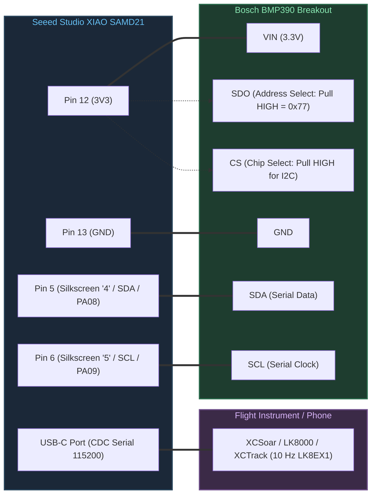

# Hardware Wiring & Pinout Guide: Seeed XIAO SAMD21 & BMP390

This document describes the electrical wiring, pin mappings, and hardware specifications for connecting the **Bosch BMP390** barometric sensor module to the **Seeed Studio XIAO SAMD21** micro-controller board.

---

## 1. Seeed XIAO SAMD21 Pinout Overview

The Seeed Studio XIAO SAMD21 is a thumb-sized microcontroller board powered by the Microchip **ATSAMD21G18A** (ARM Cortex-M0+, 48 MHz, 3.3V logic).

> [!WARNING]
> The silkscreen on the top of the Seeed XIAO board only labels the pins as simple numbers (`0` through `10`), `3V3`, `GND`, and `5V`. It does not explicitly indicate peripheral functions such as `SDA` or `SCL`. Connecting peripherals requires mapping these silkscreen numbers to their underlying SAMD21 hardware interfaces.

### Physical Pin Layout (Component Side, USB-C Port at Top)

```text
                  +-------------+
                  |  [ USB-C ]  |
                  |             |
  (PA02) [ 0 ] D0 | 1        14 | 5V   (VBUS from USB)
  (PA04) [ 1 ] D1 | 2        13 | GND  (Ground)
  (PA10) [ 2 ] D2 | 3        12 | 3V3  (3.3V Regulated Output)
  (PA11) [ 3 ] D3 | 4        11 | D10  [ 10 ] MOSI (PA06)
  (PA08) [ 4 ] D4 | 5        10 | D9   [ 9  ] MISO (PA05)
  (PA09) [ 5 ] D5 | 6         9 | D8   [ 8  ] SCK  (PA07)
  (PB08) [ 6 ] D6 | 7         8 | D7   [ 7  ] RX   (PB09)
                  +-------------+
                     [RST] Pads
                    (Underside)
```

---

## 2. Complete Pin Correlation Table

| Physical Pin # | Silkscreen Label | Arduino Pin Constant | ATSAMD21 Port Pin | SERCOM Interface | VarioUSB Function | Connected To |
|:---:|:---:|:---:|:---:|:---:|:---:|:---:|
| **1** | `0` | `PIN_A0` / `D0` / `DAC0` | `PA02` | — | Unused / Spare | NC |
| **2** | `1` | `PIN_A1` / `D1` | `PA04` | — | Unused / Spare | NC |
| **3** | `2` | `PIN_A2` / `D2` | `PA10` | — | Unused / Spare | NC |
| **4** | `3` | `PIN_A3` / `D3` | `PA11` | — | Unused / Spare | NC |
| **5** | `4` | `PIN_A4` / `D4` / `SDA` | `PA08` | `SERCOM2 PAD[0]` | **I2C Data (SDA)** | **BMP390 `SDA` / `SDI`** |
| **6** | `5` | `PIN_A5` / `D5` / `SCL` | `PA09` | `SERCOM2 PAD[1]` | **I2C Clock (SCL)** | **BMP390 `SCL` / `SCK`** |
| **7** | `6` | `PIN_A6` / `D6` / `TX` | `PB08` | `SERCOM4 PAD[0]` | UART TX (Optional) | NC |
| **8** | `7` | `PIN_A7` / `D7` / `RX` | `PB09` | `SERCOM4 PAD[1]` | UART RX (Optional) | NC |
| **9** | `8` | `PIN_A8` / `D8` / `SCK` | `PA07` | `SERCOM0 PAD[3]` | SPI SCK (Optional) | NC |
| **10** | `9` | `PIN_A9` / `D9` / `MISO` | `PA05` | `SERCOM0 PAD[1]` | SPI MISO (Optional) | NC |
| **11** | `10` | `PIN_A10` / `D10` / `MOSI` | `PA06` | `SERCOM0 PAD[2]` | SPI MOSI (Optional) | NC |
| **12** | `3V3` | `3V3` | Power Out | Internal LDO | **3.3V Power** | **BMP390 `VIN` / `VCC`** |
| **13** | `GND` | `GND` | Power GND | System Ground | **Ground Reference** | **BMP390 `GND`** |
| **14** | `5V` | `5V` | USB VBUS | 5V from Host | Unused / 5V rail | NC |

---

## 3. BMP390 Breakout Module Signals & Configuration

Common BMP390 breakout boards (Adafruit, CJMCU-390, Waveshare, DFRobot) expose 6 to 8 pins:

| Breakout Pin | Alternative Names | Description | Connection in VarioUSB |
|---|---|---|---|
| **VIN** | `VCC`, `3V3` | Power supply input (3.3V) | Connect to Seeed XIAO **`3V3`** (Pin 12) |
| **GND** | `0V` | Ground reference | Connect to Seeed XIAO **`GND`** (Pin 13) |
| **SCL** | `SCK`, `CLK` | I2C Serial Clock | Connect to Seeed XIAO **`5`** (Pin 6: `SCL`) |
| **SDA** | `SDI`, `DATA` | I2C Serial Data | Connect to Seeed XIAO **`4`** (Pin 5: `SDA`) |
| **SDO** | `ADDR`, `SA0` | I2C address bit selection | Connect to **`3V3`** (or leave floating if board has pull-up) for address **`0x77`** |
| **CS** | `CSB` | Chip select (SPI / I2C mode) | Connect to **`3V3`** (or leave open if board has pull-up) to enable **I2C mode** |
| **INT** | `INT1`, `DRDY` | Interrupt / Data Ready output | Not connected (driver polls at 50 Hz) |

> [!IMPORTANT]
> **I2C Address Verification:**  
> The VarioUSB firmware defaults to I2C target address **`0x77`** (`config::kBmp390I2cAddress = 0x77` in `common/config.hpp`).  
> - **Address `0x77`:** `SDO` pin pulled HIGH to 3.3V (standard for Adafruit breakouts).
> - **Address `0x76`:** `SDO` pin connected to `GND`. If your breakout is hardwired to `0x76`, modify `kBmp390I2cAddress = 0x76` in `src/common/config.hpp`.

---

## 4. Wiring Schematic Diagram

```text
       +-------------------------+              +-----------------------+
       |   Seeed XIAO SAMD21     |              |     BMP390 Module     |
       |                         |              |                       |
       |  [Pin 12] 3V3  ---------+--------------+--> VIN / VCC          |
       |                         |              |                       |
       |  [Pin 13] GND  ---------+--------------+--> GND                |
       |                         |              |                       |
       |  [Pin 5]   4   (SDA) ---+--------------+--> SDA / SDI          |
       |                         |              |                       |
       |  [Pin 6]   5   (SCL) ---+--------------+--> SCL / SCK          |
       +-------------------------+              |                       |
                                                |    SDO/ADDR -> 3V3    |
                                                |    CS       -> 3V3    |
                                                |    INT      -> NC     |
                                                +-----------------------+
```

### Visual Wiring Connection Flow



---

## 5. Electrical & Hardware Considerations

1. **Supply Voltage & Logic Levels:**
   - Both Seeed XIAO SAMD21 and BMP390 operate natively on **3.3V logic**.
   - Do **NOT** connect the BMP390 to the `5V` pin of the XIAO if the breakout lacks an onboard regulator, as BMP390 absolute maximum rating is 3.6V.
2. **I2C Bus Pull-Up Resistors:**
   - Standard breakout boards include 4.7 kΩ or 10 kΩ pull-up resistors on SDA and SCL to 3.3V.
   - If using a bare BMP390 without internal pull-ups, install two 4.7 kΩ resistors between `SDA -> 3V3` and `SCL -> 3V3`.
3. **Cable Length:**
   - Keep I2C wires as short as possible (under 10 cm / 4 inches) to prevent noise pickup and signal degradation in high-vibration aviation environments.
4. **Double-Tap Reset Pads:**
   - Located on the underside of the XIAO. Shorting these pads twice rapidly with tweezers forces the ATSAMD21 into its native UF2 bootloader mode (pulsing orange LED), permitting firmware upload even if a running program hangs.
