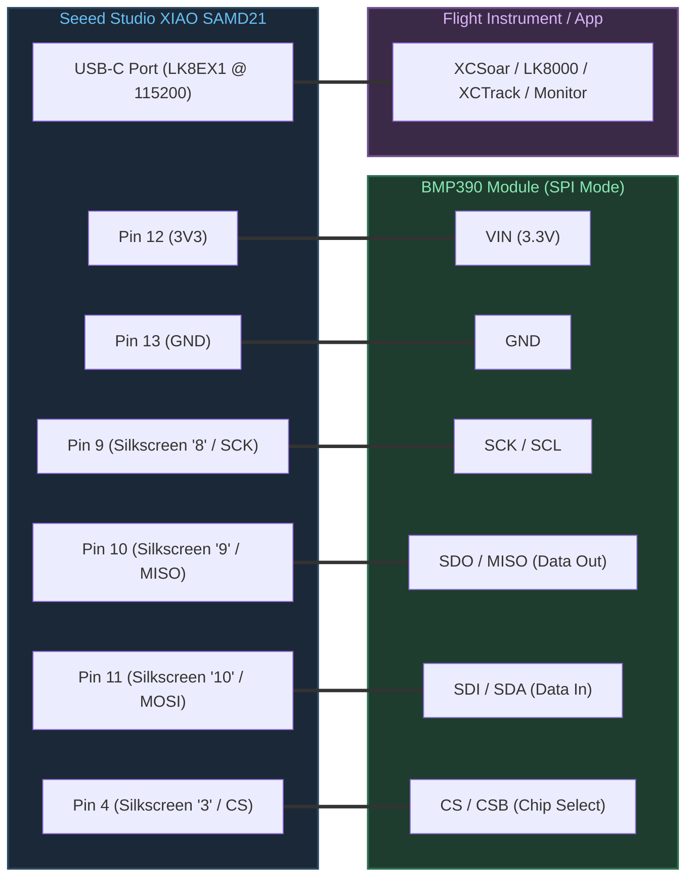
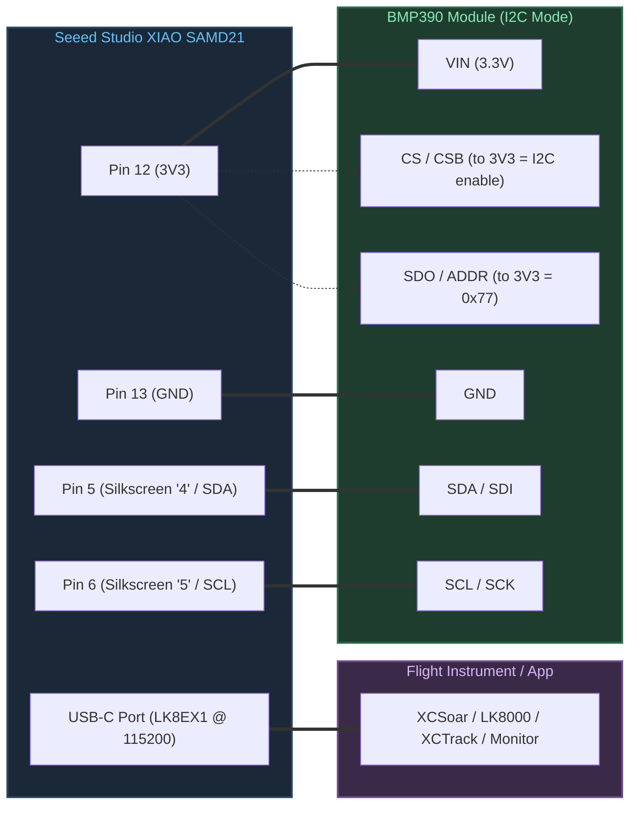

# Hardware Wiring & Pinout Guide: Seeed XIAO SAMD21 & BMP390

This document describes the electrical wiring, pin mappings, and hardware specifications for connecting the **Bosch BMP390** (or **BMP388**) barometric sensor module to the **Seeed Studio XIAO SAMD21** microcontroller board.

VarioUSB supports two communication buses:
- **4-Wire Hardware SPI** (recommended for speed, robustness, and immunity against missing pull-ups)
- **2-Wire I2C** (standard 2-wire interface, requires pull-up resistors)

---

## 1. Seeed XIAO SAMD21 Pinout Overview

The Seeed Studio XIAO SAMD21 is a thumb-sized board powered by the Microchip **ATSAMD21G18A** (ARM Cortex-M0+, 48 MHz, 3.3V logic).

> [!WARNING]
> The silkscreen on top of the Seeed XIAO only labels pins as numbers (`0` through `10`), `3V3`, `GND`, and `5V`. It does not explicitly print peripheral names (`SDA`, `SCL`, `MOSI`, `MISO`, `SCK`). You must refer to the mapping below.

### Physical Pin Layout (Component Side, USB-C Port at Top)

```text
                  +-------------+
                  |  [ USB-C ]  |
                  |             |
  (PA02) [ 0 ] D0 | 1        14 | 5V   (VBUS from USB)
  (PA04) [ 1 ] D1 | 2        13 | GND  (System Ground)
  (PA10) [ 2 ] D2 | 3        12 | 3V3  (3.3V Regulated Output)
  (PA11) [ 3 ] D3 | 4        11 | D10  [ 10 ] MOSI (PA06)
  (PA08) [ 4 ] D4 | 5        10 | D9   [ 9  ] MISO (PA05)
  (PA09) [ 5 ] D5 | 6         9 | D8   [ 8  ] SCK  (PA07)
  (PB08) [ 6 ] D6 | 7         8 | D7   [ 7  ] RX   (PB09)
                  +-------------+
                     [RST] Pads
                    (Underside)
```

---

## 2. Bus Selection in Firmware (`config.hpp`)

Switching between SPI and I2C is configured in `src/common/config.hpp`:

```cpp
// 0 = I2C Mode, 1 = SPI Mode (4-wire)
#ifndef VARIO_USE_SPI
#define VARIO_USE_SPI 1
#endif
```

| `VARIO_USE_SPI` | Active Bus | Advantages | Constraints |
|:---:|:---:|:---|:---|
| **`1` (SPI)** | 4-wire SPI (1 MHz) | • No pull-up resistors needed<br>• Higher bus speed (1 MHz)<br>• Immune to I2C bus lockup | Requires 6 wires total (`VIN`, `GND`, `SCK`, `MISO`, `MOSI`, `CS`) |
| **`0` (I2C)** | 2-wire I2C (100/400 kHz) | • Uses fewer wires (4 total)<br>• Leaves SPI pins free for other peripherals | **Requires pull-up resistors** (4.7 kΩ) on SDA & SCL<br>`CS` must be tied to 3.3V |

---

## 3. Quick Reference: Side-by-Side Pin Comparison

| BMP390 Breakout Pin | Signal Description | **SPI Connection (VARIO_USE_SPI 1)** | **I2C Connection (VARIO_USE_SPI 0)** |
|:---|:---|:---|:---|
| **`VIN` / `VCC`** | Power supply (3.3V) | **XIAO Pin 12 (`3V3`)** | **XIAO Pin 12 (`3V3`)** |
| **`GND`** | Ground reference | **XIAO Pin 13 (`GND`)** | **XIAO Pin 13 (`GND`)** |
| **`SCL` / `SCK`** | Clock line | **XIAO Pin 9 (`8` / SCK)** | **XIAO Pin 6 (`5` / SCL)** |
| **`SDA` / `SDI`** | Data Input / MOSI / SDA | **XIAO Pin 11 (`10` / MOSI)** | **XIAO Pin 5 (`4` / SDA)** |
| **`SDO` / `MISO`** | Data Output / MISO / Address | **XIAO Pin 10 (`9` / MISO)** | • To **`3V3`** for address **`0x77`** (default)<br>• To **`GND`** for address **`0x76`** |
| **`CS` / `CSB`** | Chip Select (Active LOW) | **XIAO Pin 4 (`3` / CS)** | To **`3V3`** (forces I2C mode) |
| **`INT`** | Data ready interrupt | *Not Connected (NC)* | *Not Connected (NC)* |

---

## 4. Mode 1: 4-Wire SPI Wiring (Recommended)

When `VARIO_USE_SPI 1` is configured, communication uses hardware SERCOM0 in SPI master mode.

### SPI Pin Connection Table

| Seeed XIAO Physical Pin | Silkscreen Label | Arduino Pin Name | ATSAMD21 Port | BMP390 Breakout Pin | SPI Function |
|:---:|:---:|:---:|:---:|:---:|:---|
| **Pin 12** | **`3V3`** | `3V3` | LDO Out | **`VIN`** / `VCC` | Power Supply (3.3V) |
| **Pin 13** | **`GND`** | `GND` | Power GND | **`GND`** | Ground Reference |
| **Pin 9** | **`8`** | `D8` / `PIN_SPI_SCK` | `PA07` | **`SCK`** / `SCL` | SPI Clock |
| **Pin 10** | **`9`** | `D9` / `PIN_SPI_MISO` | `PA05` | **`SDO`** / `MISO` | Master In Slave Out |
| **Pin 11** | **`10`** | `D10` / `PIN_SPI_MOSI` | `PA06` | **`SDI`** / `SDA` | Master Out Slave In |
| **Pin 4** | **`3`** | `D3` / `PIN_A3` | `PA11` | **`CS`** / `CSB` | Chip Select (Active LOW) |

> [!CAUTION]
> **SPI Data Inversion Trap:**  
> - **`SDI`** on BMP390 is Serial Data **IN** $\rightarrow$ Connect to XIAO **`10`** (`MOSI`).
> - **`SDO`** on BMP390 is Serial Data **OUT** $\rightarrow$ Connect to XIAO **`9`** (`MISO`).  
> Inverting these two pins will cause the sensor to return `CHIP=0xFF`.

### SPI Wiring Schematic

```text
       +-------------------------+              +-----------------------+
       |   Seeed XIAO SAMD21     |              |     BMP390 Module     |
       |                         |              |                       |
       |  [Pin 12] 3V3  ---------+--------------+--> VIN / VCC          |
       |  [Pin 13] GND  ---------+--------------+--> GND                |
       |  [Pin 9 ]  8   (SCK)  --+--------------+--> SCK / SCL          |
       |  [Pin 10]  9   (MISO) -+---------------+--> SDO / MISO         |
       |  [Pin 11] 10   (MOSI) -+---------------+--> SDI / SDA          |
       |  [Pin 4 ]  3   (CS)   --+--------------+--> CS  / CSB          |
       +-------------------------+              |    INT      -> NC     |
                                                +-----------------------+
```

### SPI Connection Flow



---

## 5. Mode 2: 2-Wire I2C Wiring

When `VARIO_USE_SPI 0` is configured, communication uses hardware SERCOM2 in I2C master mode.

### I2C Pin Connection Table

| Seeed XIAO Physical Pin | Silkscreen Label | Arduino Pin Name | ATSAMD21 Port | BMP390 Breakout Pin | I2C Function |
|:---:|:---:|:---:|:---:|:---:|:---|
| **Pin 12** | **`3V3`** | `3V3` | LDO Out | **`VIN`** / `VCC` | Power Supply (3.3V) |
| **Pin 13** | **`GND`** | `GND` | Power GND | **`GND`** | Ground Reference |
| **Pin 5** | **`4`** | `D4` / `PIN_A4` / `SDA` | `PA08` | **`SDA`** / `SDI` | I2C Serial Data |
| **Pin 6** | **`5`** | `D5` / `PIN_A5` / `SCL` | `PA09` | **`SCL`** / `SCK` | I2C Serial Clock |
| — | — | — | — | **`CS`** / `CSB` | Connect to **`3V3`** (forces I2C mode) |
| — | — | — | — | **`SDO`** / `ADDR` | • Connect to **`3V3`** $\rightarrow$ Address **`0x77`** (default)<br>• Connect to **`GND`** $\rightarrow$ Address **`0x76`** |

> [!IMPORTANT]
> **I2C Address Matching:**  
> The address in `src/common/config.hpp` must match the `SDO` pin state:
> - `SDO` connected to **`3V3`** $\rightarrow$ `kBmp390I2cAddress = 0x77` (current code default)
> - `SDO` connected to **`GND`** $\rightarrow$ `kBmp390I2cAddress = 0x76`

> [!WARNING]
> **I2C Pull-Up Resistors are Mandatory:**  
> The internal pull-up resistors of the SAMD21 are high-impedance (~40 kΩ) and cannot sustain standard I2C waveforms. If your breakout board does not have onboard 4.7 kΩ pull-ups, you **must** add two 4.7 kΩ resistors externally:
> - One resistor between **`SDA`** (Pin 4) and **`3V3`**
> - One resistor between **`SCL`** (Pin 5) and **`3V3`**  
> Without these, the I2C scanner will report `No I2C devices found!`.

### I2C Wiring Schematic

```text
       +-------------------------+              +-----------------------+
       |   Seeed XIAO SAMD21     |              |     BMP390 Module     |
       |                         |              |                       |
       |  [Pin 12] 3V3  ---------+---+----------+--> VIN / VCC          |
       |                         |   |   |      |                       |
       |                         |  [4k7][4k7]  |    CS       -> 3V3    |
       |                         |   |   |      |    SDO/ADDR -> 3V3 (0x77)
       |  [Pin 13] GND  ---------+---+---+------+--> GND                |
       |                         |   |   |      |                       |
       |  [Pin 5]   4   (SDA) ---+---+---|------+--> SDA / SDI          |
       |  [Pin 6]   5   (SCL) ---+-------+------+--> SCL / SCK          |
       +-------------------------+              |    INT      -> NC     |
                                                +-----------------------+
```

### I2C Connection Flow



---

## 6. Electrical & Hardware Considerations

1. **Supply Voltage & Logic Levels:**
   - Both Seeed XIAO SAMD21 and BMP390 operate natively on **3.3V logic**.
   - Do **NOT** connect the BMP390 to the `5V` pin of the XIAO if the breakout lacks an onboard regulator, as BMP390 absolute maximum rating is 3.6V.
2. **Wire Length:**
   - Keep wires as short as possible (under 10 cm / 4 inches) to prevent RF pickup and capacitive signal degradation in aviation environments.
3. **Double-Tap Reset Pads:**
   - Located on the underside of the XIAO. Shorting these pads twice rapidly with tweezers forces the ATSAMD21 into native UF2 bootloader mode (pulsing orange LED), permitting firmware upload even if a running program hangs.
4. **Supported Sensor Chip IDs:**
   - **`0x60`**: Bosch BMP390
   - **`0x50`**: Bosch BMP388 (fully pin-to-pin and register-compatible; supported automatically by VarioUSB firmware)
